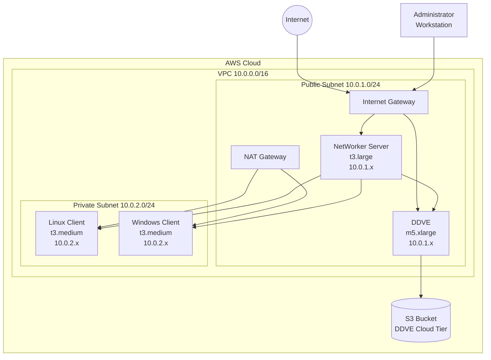

# AWS NetWorker Lab Architecture

## Overview

This document provides detailed architectural information about the AWS NetWorker Lab deployment.

## Network Architecture



## Component Details

### NetWorker Server
- **Purpose**: Central backup management and orchestration
- **Instance Type**: t3.large (2 vCPU, 8 GB RAM)
- **Storage**: 100 GB encrypted EBS (gp3)
- **Network**: Public subnet with Elastic IP
- **Services**:
  - NetWorker Server daemon (port 7937-7938)
  - Management Console (port 9001)
  - REST API (port 9090)
  - RPC services (port 111)

### Data Domain Virtual Edition (DDVE)
- **Purpose**: Deduplication storage with cloud tiering
- **Instance Type**: t3.xlarge (4 vCPU, 16 GB RAM with burst)
- **Storage**: 
  - Root: 250 GB encrypted EBS (gp3) - OS and software
  - NVRAM: 10 GB encrypted EBS (gp3) - Write cache
  - Metadata: 100 GB encrypted EBS (gp3) - Deduplication metadata
  - Cloud Tier: S3 bucket for primary data storage
- **Network**: Public subnet with Elastic IP
- **Services**:
  - DDVE System Manager (port 443)
  - DD Boost (port 2049)
  - Replication (port 2051)

### Linux Client
- **Purpose**: Backup client for Linux workloads
- **OS**: Red Hat Enterprise Linux 8
- **Instance Type**: t3.medium (2 vCPU, 4 GB RAM)
- **Storage**: 50 GB encrypted EBS (gp3)
- **Network**: Private subnet (NAT for outbound)

### Windows Client
- **Purpose**: Backup client for Windows workloads
- **OS**: Windows Server 2022
- **Instance Type**: t3.medium (2 vCPU, 4 GB RAM)
- **Storage**: 50 GB encrypted EBS (gp3)
- **Network**: Private subnet (NAT for outbound)

## Security Architecture

### Network Security
1. **VPC Isolation**: Dedicated VPC with controlled ingress/egress
2. **Subnet Segregation**: 
   - Public subnet for management components
   - Private subnet for client systems
3. **NAT Gateway**: Secure outbound internet access for private instances

### Security Groups
- **NetWorker Server SG**:
  - SSH (22) from admin IP
  - NetWorker Console (9001) from admin IP
  - NetWorker services from VPC CIDR
  
- **DDVE SG**:
  - SSH (22) from admin IP
  - HTTPS (443) from admin IP
  - DD Boost (2049) from NetWorker Server
  
- **Client SGs**:
  - Limited access only from NetWorker Server
  - No direct internet access

### Data Protection
- All EBS volumes encrypted at rest
- S3 bucket encryption (AES-256)
- TLS for all management interfaces
- SSH key-based authentication

## Automation Architecture

### Infrastructure as Code (Terraform)
```
terraform/
├── main.tf           # Provider and core resources
├── variables.tf      # Input variables
├── network.tf        # VPC and networking
├── security_groups.tf # Security configurations
├── compute.tf        # EC2 instances
└── outputs.tf        # Outputs and inventory
```

### Configuration Management (Ansible)
```
ansible/
├── playbooks/
│   └── site.yml      # Main orchestration playbook
└── roles/
    ├── common/       # Base configuration
    ├── install_agent/ # NetWorker agent installation
    ├── configure_nve/ # NetWorker server setup
    ├── configure_ddve/ # DDVE configuration
    └── configure_backup/ # Backup policies
```

## Data Flow

1. **Backup Flow**:
   ```
   Client → NetWorker Server → DDVE → S3 (Cloud Tier)
   ```

2. **Management Flow**:
   ```
   Admin → Internet → NetWorker Console/DDVE Manager
   ```

3. **Restore Flow**:
   ```
   S3 → DDVE → NetWorker Server → Client
   ```

## High Availability Considerations

While this lab environment is not configured for HA, production deployments should consider:

1. **Multi-AZ Deployment**: Distribute components across availability zones
2. **Auto Scaling Groups**: For client systems
3. **RDS for PostgreSQL**: Instead of local database for NetWorker
4. **ELB**: For load balancing multiple NetWorker servers
5. **Cross-Region Replication**: For S3 bucket

## Monitoring and Logging

### CloudWatch Integration
- VPC Flow Logs enabled
- Instance metrics collection
- Custom metrics for backup success/failure

### Application Logs
- NetWorker logs: `/nsr/logs/`
- DDVE logs: `/opt/ddve/logs/`
- Ansible execution logs: Local retention

## Cost Optimization

### Instance Right-Sizing
- Development: Use smaller instances (t3.small/medium)
- Production: Scale based on workload analysis
- Consider Spot instances for non-critical clients

### Storage Optimization
- S3 lifecycle policies (transition to IA after 30 days)
- EBS snapshot scheduling
- Delete unused volumes

### Operational Cost Reduction
- Stop instances when not in use (`make stop`)
- Implement auto-shutdown schedules
- Use Reserved Instances for long-term deployments